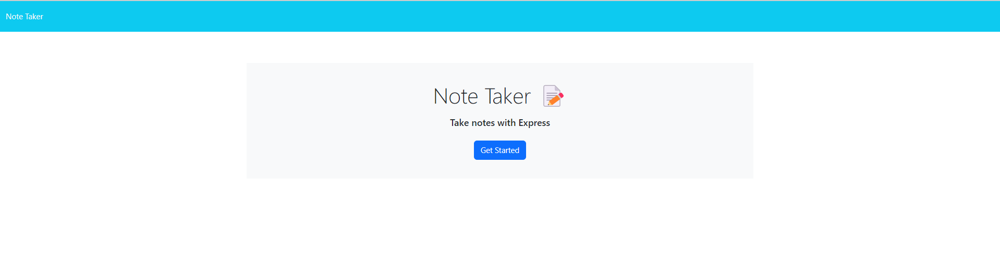

# Express.js Note Taker Application

## Description

This application creates an online note taker using a number of different technologies across the frontend and backend. This assignment was done in order to improve upon utilization of node and express.js to develop backend architecture. The frontend of the application is built using HTML, CSS and JavaScript. From here, I was able to learn about deploying backend applications to Heroku after designing them with Express.js frameworks.

## Table of Contents (Optional)

- [Installation](#installation)
- [Usage](#usage)
- [Credits](#credits)
- [License](#license)

## Installation

What are the steps required to install your project? Provide a step-by-step description of how to get the development environment running.

To install this application, please install node.js on your computer. TO do this, within your terminal, enter the commands "npm install node." Additionally, clone the code from the following GitHub repository to your local machine. 

https://github.com/nabeekha/Express.js-note-taker 

## Usage

To utilize this application, please open up the front end application at any time from the live server. From here, go to the deployed application link below. 

Link:

Please feel free to see images of the live application below:

## Credits

There are no collaborators for this application. I am the primary developer. The only tutorials followed are from the EdX Georgia Tech Coding Bootcamp.

## License

This application uses the MIT License. Because of this, it is open for utilization across the web.

## How to Contribute

No contribution is needed at this time. Please feel free to leverage the code here for the purpose of developing your own applications. 
